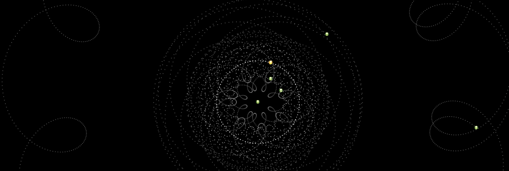

# Beautiful non-heliocentric orbits

At a time, the Earth was believed to be the center of the solar system, and models were invented to describe the apparent erratic motion of non-Earthly planets (retrograde motion).

One can imagine that such models could have been invented by Martians, Venusians, etc. to justify their planet as the center of them all.

This is a Javascript canvas-based animation which draws the orbits of the planets in relation to a chosen planet.

A live demo is [available here](https://jamesmurdza.github.io/copernicator/).

*Orbits of the planets as seen relative to Earth*