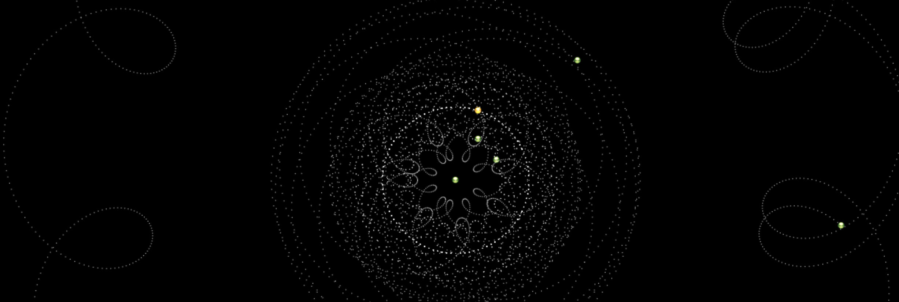

# Beautiful non-heliocentric orbits (CSS-only)

At a time, the Earth was believed to be the center of the solar system, and models were invented to describe the apparent erratic motion of non‑Earthly planets (retrograde motion).

One can imagine that such models could have been invented by Martians, Venusians, etc. to justify their planet as the center of them all.

This project now renders the solar system using pure CSS animations. A tiny bit of JavaScript is used only to keep the user‑selected planet centered and to apply discrete zoom levels. There is no canvas and no Phaser.

A live demo is still available via GitHub Pages for this repo.

_Orbits of the planets as seen relative to Earth_

## How it works

- The scene is a square viewport (`.viewport`) that contains a `#system` element.
- All motion is done with CSS keyframes. Each planet is represented by:
  - an `.orbit` ring (a thin circular border), sized with a CSS variable `--r` derived from the distance multipliers in the original `copernicus.js` (0, .39, .72, 1, 1.52, 5.20, 9.54) scaled by `--unit`.
  - an `.orbiter` that rotates with `@keyframes orbit` where the duration is set by the orbital period (relative to Earth): 1, .24, .62, 1, 1.88, 11.86, 29.46.
  - a `.planet` dot positioned at `translateX(var(--r))` inside the orbiter.
- Colors match the original approximations from `copernicus.js`:
  - Sun `#ffff00`, Mercury `#ff0000`, Venus `#cccccc`, Earth `#0000ff`, Mars `#ff8800`, Jupiter `#00ff00`, Saturn `#8800ff`.
- To center the selected planet while everything animates, a lightweight `requestAnimationFrame` loop reads the planet’s screen position and sets two CSS custom properties on `#system`: `--offset-x` and `--offset-y`. The transform `translate(var(--offset-x), var(--offset-y)) scale(var(--zoom))` keeps the chosen planet centered continuously.
- If a user prefers reduced motion, the CSS disables the orbit animations.

## Controls

The controls are purely HTML and CSS (keyboard‑friendly):

- Center on: a radio group to choose Sun, Mercury, Venus, Earth, Mars, Jupiter, or Saturn.
- Zoom: three discrete levels (0.8×, 1.0× default, 1.6×). Selecting a zoom updates the CSS variable `--zoom`.

The minimal JavaScript only:

- Tracks which planet radio is selected and which zoom level is active.
- On each animation frame, updates `--offset-x` and `--offset-y` to center the selected planet.
- Updates `--zoom` on the `#system` element when the zoom radios change.

No other JavaScript logic is used.

## Running locally

No build step is required:

1. Open `index.html` in any modern browser.
2. Use the controls in the top‑left to pick a planet and adjust zoom.

## Notes

- The previous `copernicus.js` Phaser/canvas implementation has been removed. There are no trails; planets are simple colored dots orbiting on rings.
- Distances and orbital periods are scaled for practicality but preserve the original relative ratios from `copernicus.js`.
